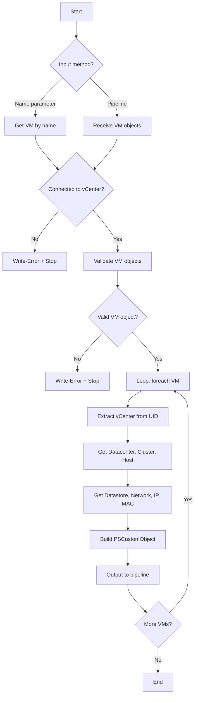
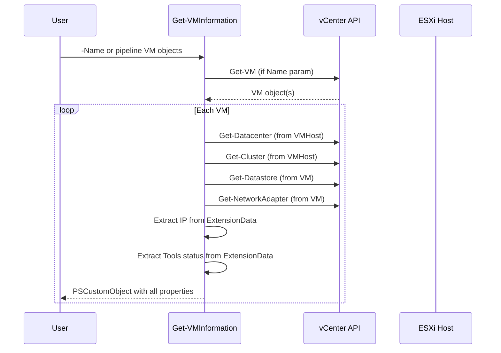

# Get-VMInformation

## Synopsis

Returns comprehensive VM details from vCenter including placement, networking, and tools status.

## Description

Queries a connected vCenter for VM objects and returns a structured PSCustomObject with datacenter, cluster, host, datastore, folder, guest OS, network, IP, MAC, and VMware Tools info. Supports both direct name input and pipeline input from `Get-VM`.

## Prerequisites

- PowerShell 5.1+
- VMware.PowerCLI module
- Active vCenter connection (`Connect-VIServer`)

## Parameters

| Parameter | Type | Required | Description |
|-----------|------|----------|-------------|
| Name | string[] | No | VM name(s) to query. Accepts wildcards. |
| InputObject | PSObject[] | No | VM object(s) from pipeline (`Get-VM` output) |

## Output

| Property | Type | Description |
|----------|------|-------------|
| Name | string | VM name |
| PowerState | string | PoweredOn, PoweredOff, Suspended |
| vCenter | string | Connected vCenter server |
| Datacenter | string | Parent datacenter |
| Cluster | string | Parent cluster |
| VMHost | string | ESXi host running the VM |
| Datastore | string | Datastore(s), comma-separated |
| FolderName | string | vCenter folder location |
| GuestOS | string | Full guest OS name |
| NetworkName | string | Port group(s), comma-separated |
| IPAddress | string | Guest IP address(es), comma-separated |
| MacAddress | string | NIC MAC address(es), comma-separated |
| VMTools | string | Tools version status |

## Examples

```powershell
# Single VM by name
Get-VMInformation -Name 'server01'

# Multiple VMs
Get-VMInformation -Name 'server01', 'server02', 'server03'

# Pipeline from Get-VM
Get-VM -Location 'Production' | Get-VMInformation

# Export to CSV
Get-VM -Name 'web*' | Get-VMInformation | Export-Csv -Path '.\reports\vm-info.csv' -NoTypeInformation

# Filter powered-off VMs
Get-VM | Get-VMInformation | Where-Object PowerState -eq 'PoweredOff'
```

## Flow Diagram



## Sequence Diagram



## Notes

- Requires active vCenter connection — fails fast if `$Global:DefaultVIServer` is null
- Progress bar displayed during processing
- Multi-value properties (Datastore, NetworkName, IP, MAC) are comma-separated strings
- Does not include CPU count, RAM, or disk sizing — use `Get-VM` directly for those
- Original author: theSysadminChannel (2019)
