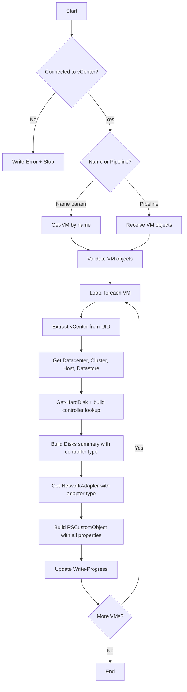
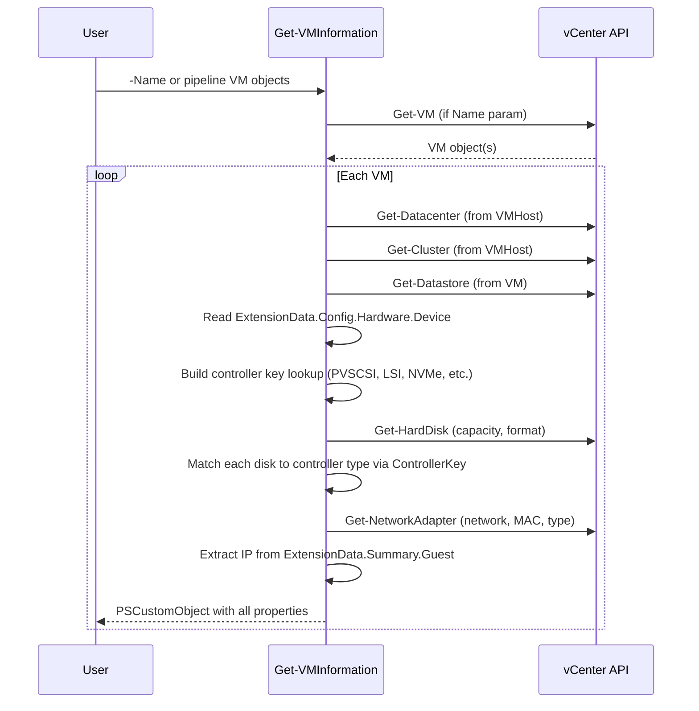

# Get-VMInformation

## Synopsis

Returns comprehensive VM details from vCenter including placement, networking, disk controllers, and tools status.

## Description

Queries a connected vCenter for VM objects and returns a structured PSCustomObject with datacenter, cluster, host, datastore, folder, guest OS, CPU, RAM, disk details with controller types, NIC details with adapter types, IP, MAC, and VMware Tools info. Supports both direct name input and pipeline input from `Get-VM`.

## Prerequisites

- PowerShell 5.1+
- VMware.PowerCLI module
- Active vCenter connection (`Connect-VIServer`)

## Parameters

| Parameter | Type | Required | Description |
|-----------|------|----------|-------------|
| Name | string[] | No | VM name(s) to query. Accepts wildcards. |
| InputObject | PSObject[] | No | VM object(s) from pipeline (`Get-VM` output) |

## Output

| Property | Type | Description |
|----------|------|-------------|
| Name | string | VM name |
| PowerState | string | PoweredOn, PoweredOff, Suspended |
| vCenter | string | Connected vCenter server |
| Datacenter | string | Parent datacenter |
| Cluster | string | Parent cluster |
| VMHost | string | ESXi host running the VM |
| Datastore | string | Datastore(s), comma-separated |
| FolderName | string | vCenter folder location |
| GuestOS | string | Full guest OS name |
| NumCPU | int | vCPU count |
| MemoryGB | int | RAM in GB |
| DiskCount | int | Number of hard disks |
| TotalDiskGB | double | Sum of all disk capacity in GB |
| Disks | string | Per-disk detail: `Name:SizeGB(Format)[Controller]` |
| NetworkName | string | Port group(s), comma-separated |
| NICs | string | Per-NIC detail: `Name:Network(AdapterType)` |
| IPAddress | string | Guest IP address(es), comma-separated |
| MacAddress | string | NIC MAC address(es), comma-separated |
| VMTools | string | Tools version status |

### Disks Format

```
Hard disk 1:100GB(Thick)[PVSCSI]; Hard disk 2:50GB(Thin)[LSI Logic SAS]
```

Controller types resolved: PVSCSI, LSI Logic SAS, LSI Logic, BusLogic, NVMe, IDE, SATA.

### NICs Format

```
Network adapter 1:VLAN-Production(Vmxnet3); Network adapter 2:VLAN-Backup(E1000e)
```

Adapter types: Vmxnet3, E1000e, E1000, Flexible, etc.

## Examples

```powershell
# Single VM by name
Get-VMInformation -Name 'server01'

# Multiple VMs
Get-VMInformation -Name 'server01', 'server02', 'server03'

# Pipeline from Get-VM
Get-VM -Location 'Production' | Get-VMInformation

# Export to CSV
Get-VM -Name 'web*' | Get-VMInformation | Export-Csv -Path '.\reports\vm-info.csv' -NoTypeInformation

# Filter powered-off VMs
Get-VM | Get-VMInformation | Where-Object PowerState -eq 'PoweredOff'

# Find VMs using LSI Logic controllers
Get-VM | Get-VMInformation | Where-Object Disks -like '*LSI*'

# Find VMs with E1000 NICs (candidates for upgrade to vmxnet3)
Get-VM | Get-VMInformation | Where-Object NICs -like '*E1000*'
```

## Flow Diagram



## Sequence Diagram



## Notes

- Requires active vCenter connection — fails fast if `$Global:DefaultVIServer` is null
- Progress bar displayed during processing
- Multi-value properties (Datastore, NetworkName, IP, MAC) are comma-separated strings
- Disk and NIC detail strings use semicolons as separators for CSV-friendly export
- Controller type resolved from ExtensionData device list — maps ControllerKey to human-readable type
- Original author: theSysadminChannel (2019), extended with disk/NIC detail
