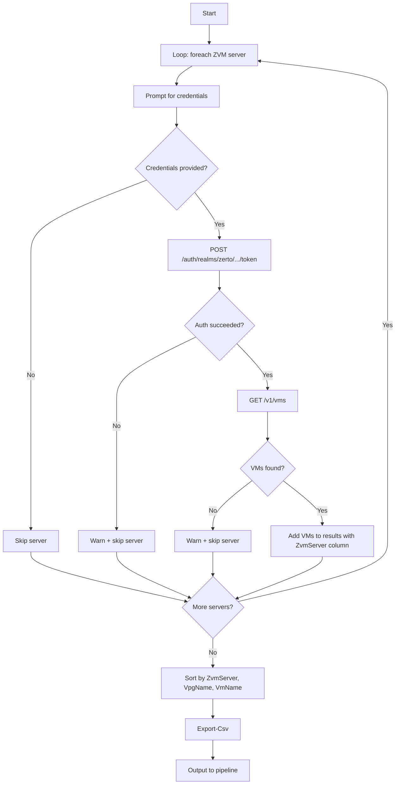
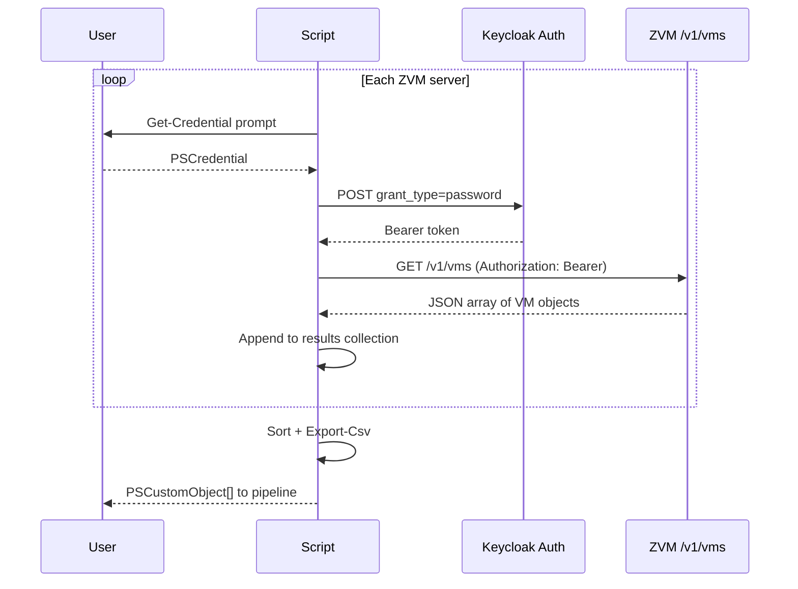

# Get-ZertoAllVpgVMs

## Synopsis

Exports all Zerto-protected VMs grouped by VPG to CSV.

## Description

Authenticates to the ZVM REST API using Keycloak token auth (Zerto 10.x), queries `/v1/vms` for all protected VMs across all VPGs, and exports a sorted CSV. No need to know VPG names in advance — the script discovers them automatically.

## Prerequisites

- PowerShell 7+
- Network access to ZVM on port 443
- Zerto API credentials with read access
- Zerto 10.x with Keycloak authentication

## Parameters

| Parameter | Type | Required | Default | Description |
|-----------|------|----------|---------|-------------|
| ZvmServer | string | Yes | — | Hostname or IP of the ZVM |
| Port | int | No | 443 | ZVM API port |
| Credential | PSCredential | No | Prompts | API credentials |
| ExportCsv | string | No | `.\reports\ZertoVpgVMs_<date>.csv` | Path to export CSV |

## Output

| Property | Type | Description |
|----------|------|-------------|
| VpgName | string | Protection group name |
| VmName | string | Virtual machine name |
| UsedStorageMB | int | Used storage in MB |
| SourceSite | string | Source Zerto site |
| TargetSite | string | Target replication site |
| Priority | string | VPG priority level |
| Status | string | VM protection status |

Results are sorted by VpgName then VmName.

## Examples

```powershell
# Export all VPGs and VMs (auto-generates filename with date)
.\Get-ZertoAllVpgVMs.ps1 -ZvmServer 'zvm.example.com'

# Custom export path
.\Get-ZertoAllVpgVMs.ps1 -ZvmServer 'zvm.example.com' -ExportCsv '.\reports\zerto-full-inventory.csv'

# Capture results and filter in-session
$all = .\Get-ZertoAllVpgVMs.ps1 -ZvmServer 'zvm.example.com'
$all | Group-Object VpgName | Select-Object Count, Name

# Find VMs in a specific VPG from the results
$all | Where-Object VpgName -eq 'SQL-Prod'
```

## Flow Diagram



## Sequence Diagram



## API Details

- **Endpoint**: `GET /v1/vms` (no filter — returns all protected VMs)
- **Auth**: Keycloak OAuth2 token via `/auth/realms/zerto/protocol/openid-connect/token`
- **Port**: 443 (default)
- **Timeout**: 120 seconds (larger dataset)

## Notes

- CSV is always exported (default path includes date for versioning)
- Output directory is created automatically if missing
- Console shows green summary line with VM count and VPG count
- Results also output to pipeline for further filtering/grouping
- Self-signed certificates accepted via `-SkipCertificateCheck`
